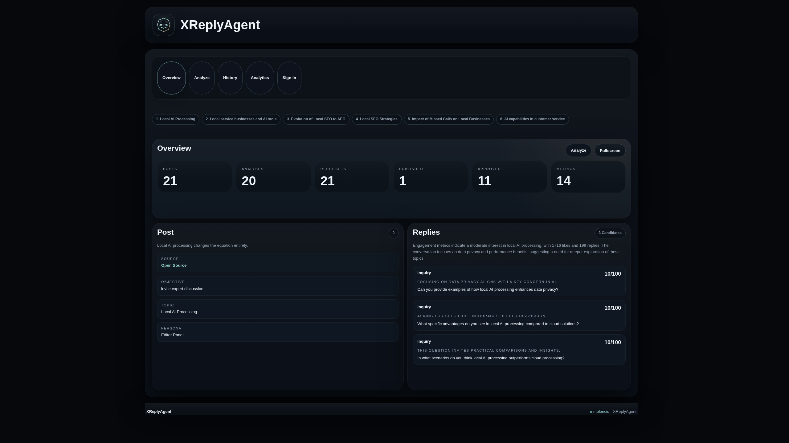
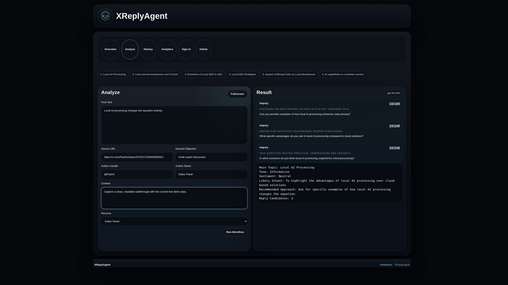
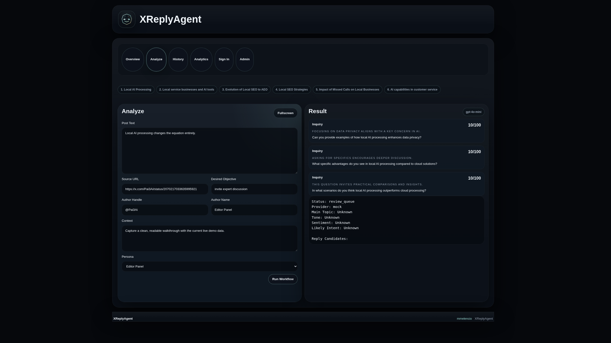
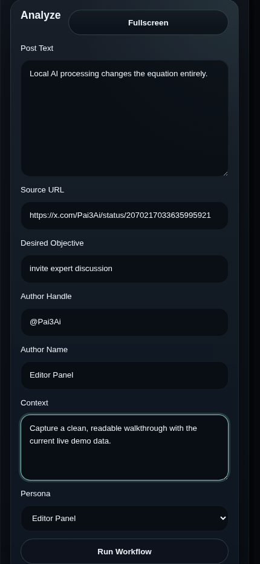
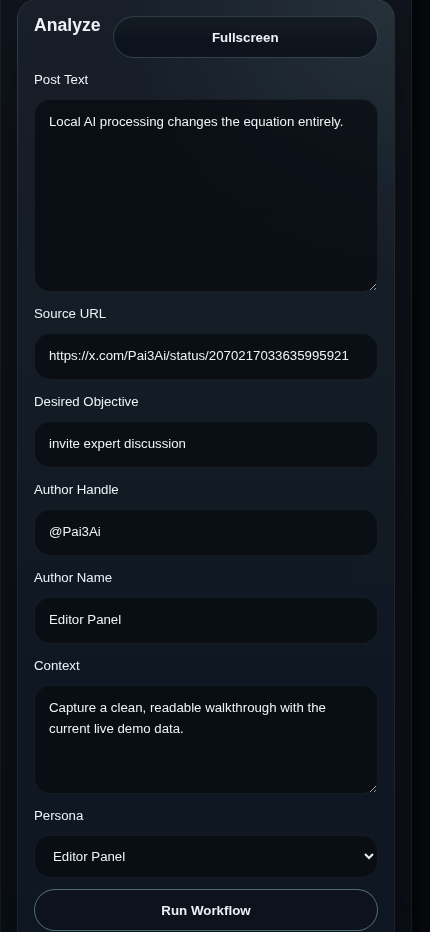
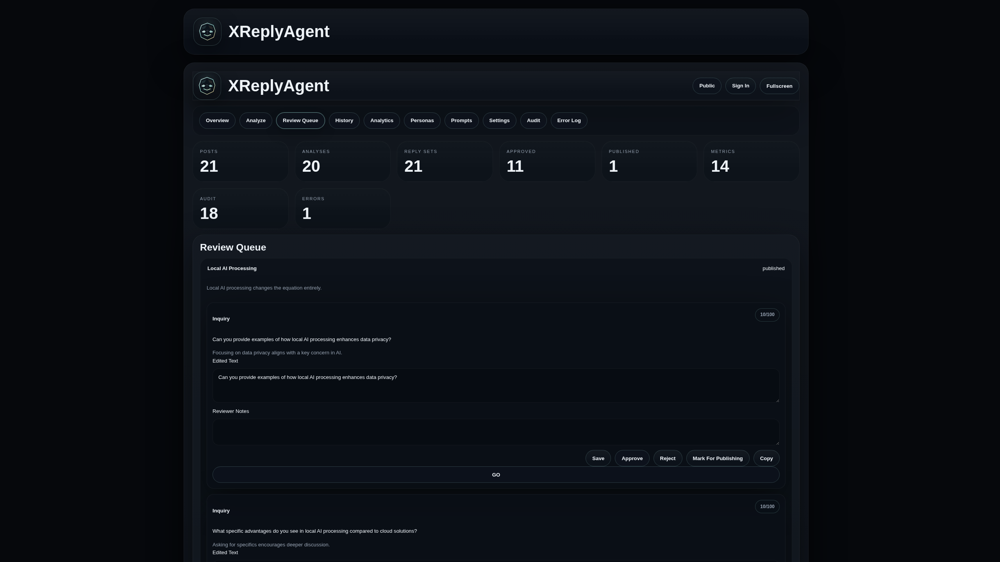
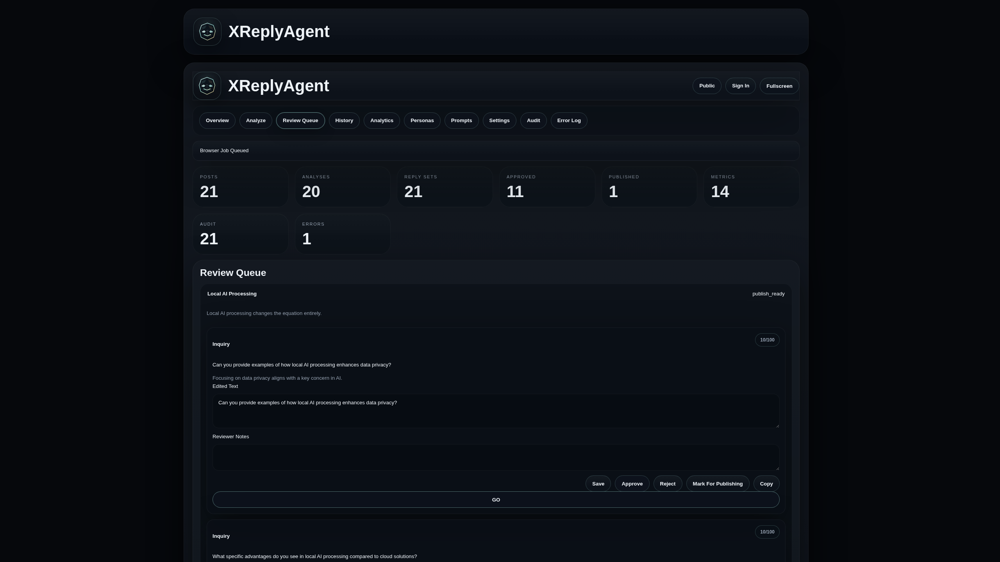
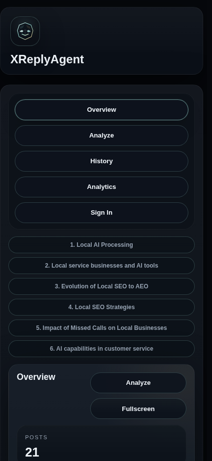
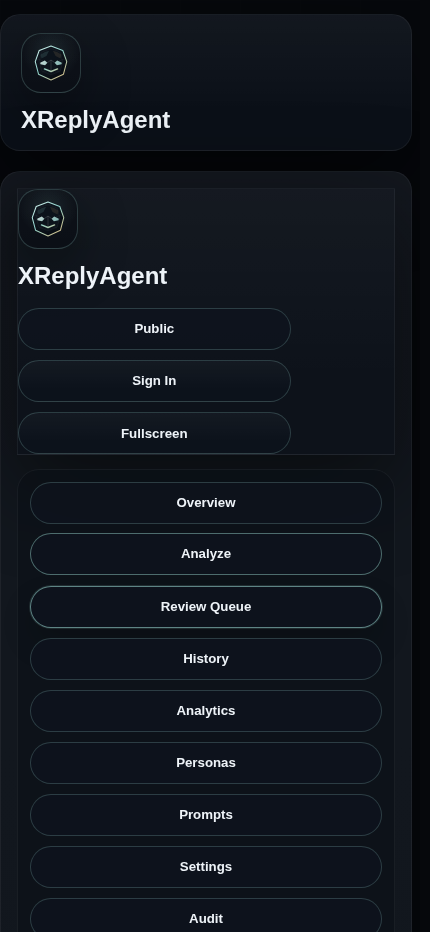
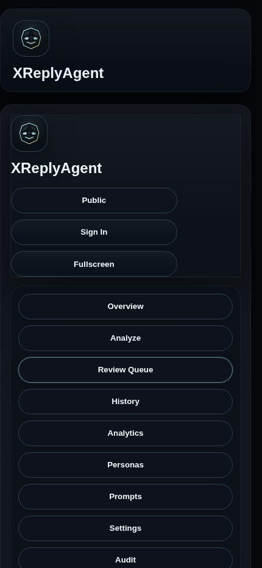

# XReplyAgent

XReplyAgent is a self-contained, update-safe native Web app for mobile and desktop, packaged for structured X post analysis, reply generation, human review, browser-assisted publishing, monitoring, audit trails, analytics, and CSV export.

## Live Demo

- App: https://audsnaps.ariadev.tools/apps/xreplyagent/
- Public walkthroughs: https://audsnaps.ariadev.tools/apps/xreplyagent/app/walkthroughs/
- Admin walkthroughs: https://audsnaps.ariadev.tools/apps/xreplyagent/admin/walkthroughs/

Demo credentials:

- User: `demouser` / `demouser`
- Admin: `demoadmin` / `demoadmin`

## Walkthrough Videos

- Customer desktop: https://audsnaps.ariadev.tools/wp-content/plugins/xreplyagent/assets/media/walkthroughs/videos/customer-desktop.mp4
- Customer mobile: https://audsnaps.ariadev.tools/wp-content/plugins/xreplyagent/assets/media/walkthroughs/videos/customer-mobile.mp4
- Admin desktop: https://audsnaps.ariadev.tools/wp-content/plugins/xreplyagent/assets/media/walkthroughs/videos/admin-desktop.mp4
- Admin mobile: https://audsnaps.ariadev.tools/wp-content/plugins/xreplyagent/assets/media/walkthroughs/videos/admin-mobile.mp4

## Screenshots

### Customer Desktop

### Customer Mobile

### Admin Desktop

### Admin Mobile

## Design Direction

- Clean
- Structural
- Restrained
- Minimalist
- Enterprise-oriented
- Dark shell with clear hierarchy

## Core Workflow

1. A user pastes an X post URL.
2. The plugin analyzes the post and generates ranked replies.
3. A human reviews, edits, and marks a reply for publishing.
4. The browser worker enters the chosen reply.
5. The system monitors activity and logs the outcome.

## Data And AI

- Provider: OpenAI
- Default model: `gpt-4o-mini`
- Mock mode is available when no key is configured.
- Qdrant-backed retrieval is used for knowledge-heavy flows where configured.

## Configuration

- API provider, model, limits, and retention are configurable in the plugin settings.
- Secret material is intentionally not committed.
- Use a private local key file or environment-backed setting in your own deployment.

## Security And Accessibility

- Capability checks
- Nonces
- Prepared queries
- Sanitization and escaping
- REST permission callbacks
- Keyboard-friendly, semantic, server-rendered UI

## Notes

- The plugin uses custom tables for operational records and audit data.
- Demo data and reset flows are available for client presentation and test runs.
- The walkthrough assets are device-specific for desktop and mobile presentation.
